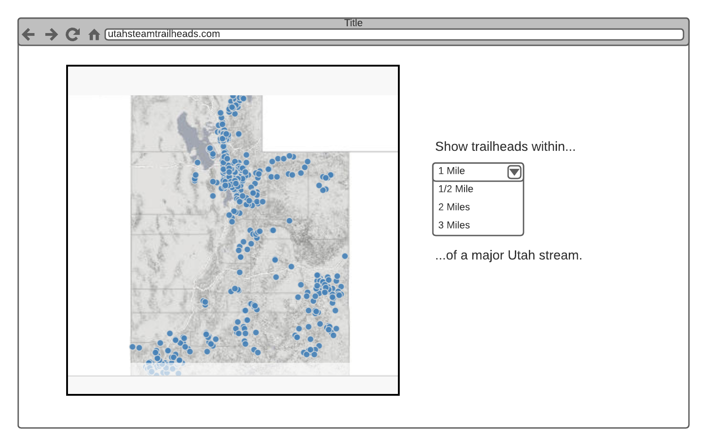

# Mapping Performance Demo

## Overview
This is a repository of several versions of the same "Utah Stream Trailheads" app with varying degrees of performance. The app displays all the trailheads on a map of Utah within a given distance of a major Utah stream/river.

The app versions are found in [api-versions](./api-versions) and listed in increasing order of performance.

While there are many _geo-specific_ optimization techniques you would want to use in production or in a larger application, I chose to focus on improvements that can be made to almost _any_ web application.

## API Versions
1. [No Database](./api-versions/1-no-db) - In this one the geoprocessing happens in-memory in a Node.js proccess with the help of [Turf.js](https://turfjs.org/). Given how long the geoprocessing takes, this version isn't really usable.
1. [PostGreSQL](./api-versions/2-postgres) - Here we've loaded our datasets into a production-grade database with a [geoprocessing extension](https://postgis.net/). The queries now take somewhere on the order of four seconds.
1. [PostGreSQL with an Index](./api-versions/3-postgres-indexed) - The only difference between this one and previous is the addition of an index. In our case, it's a [spatial index](https://postgis.net/workshops/postgis-intro/indexing.html#how-spatial-indexes-work), but the principle of indexing applies to any database-backed application. Our index makes the queries orders of magnitude faster. So fast, that we'll need to use a benchmarking tool to measure them.
1. [Static Assets](./api-versions-4-static-assets) - Because our application offers a finite set of discrete distance settings, we can preemptively complete the geoprocessing for each distance and cache the result as a static geojson file. When we serve these up behind [nginx](https://nginx.org/en/), a production-grade webserver, this version becomes extremely fast and bullet-proof. We have exploited the nature of our application to _significantly_ increase performance.

## Credits
- Datasets fetched from Utah SGID, specifically [major streams](https://opendata.gis.utah.gov/datasets/utah-major-streams-statewide) and [trailheads](https://opendata.gis.utah.gov/datasets/utah-trailheads).
- [Josh Crozier](https://github.com/JoshCrozier)'s [cryptoprice.io](https://cryptoprice.io/) for inspiration.